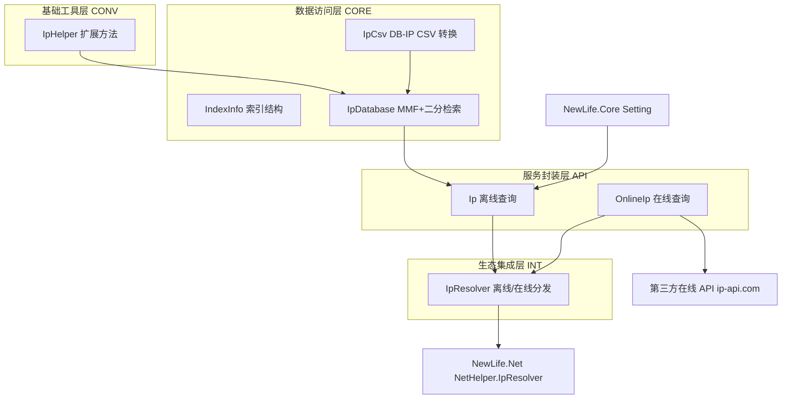
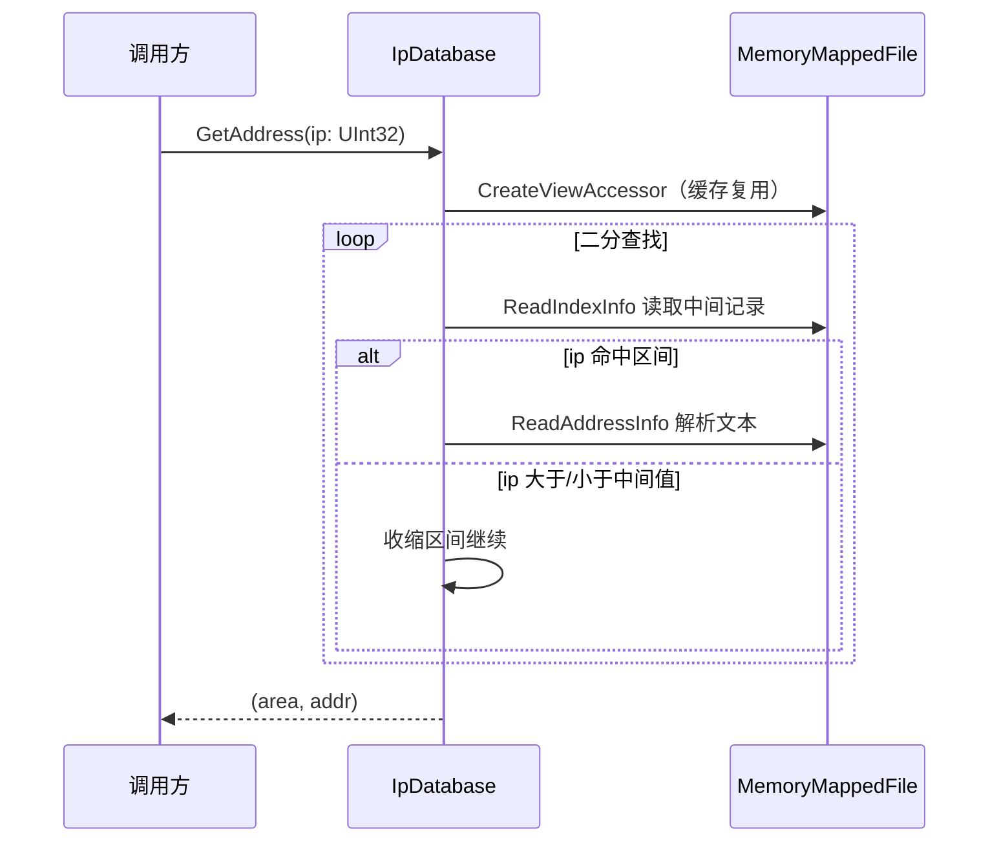
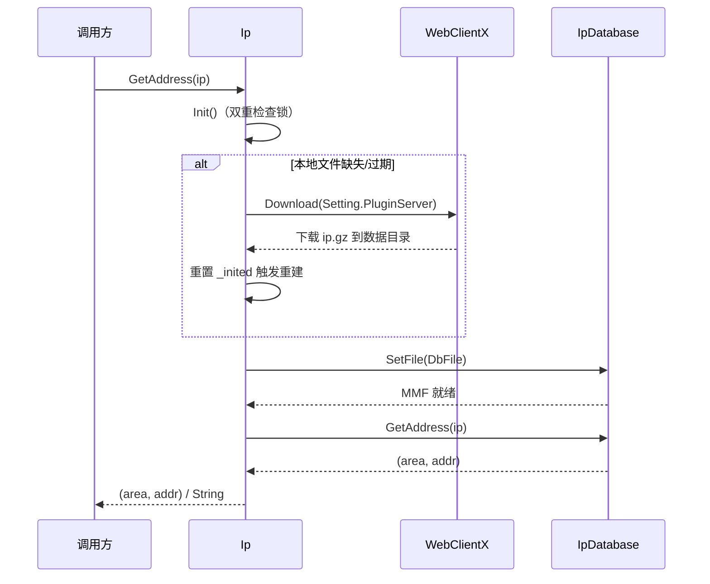
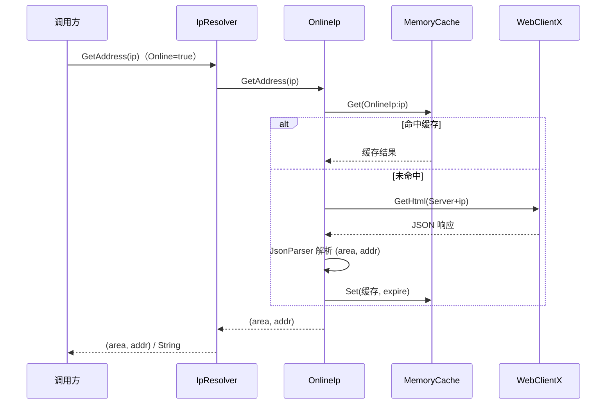

# NewLife.IP架构设计

> 版本：v1.0 | 日期：2026-08-04
> 需求对应：[需求文档](需求文档.md) | 功能清单：[功能清单](功能清单.md)

## 1. 整体架构

纯类库，按依赖关系自底向上分层，支持**离线 / 在线双数据源**：

- **基础工具层（CONV）**：`IpHelper` 提供 IP / UInt32 / 字符串互转，无内部依赖。
- **数据访问层（CORE）**：`IpDatabase` 基于 MMF 直接访问数据库文件，`IndexInfo` 描述 7 字节索引记录；`IpCsv` 提供 DB-IP CSV 转换（CORE-5）。
- **服务封装层（API）**：`Ip` 负责离线数据文件定位、自动下载更新、懒加载初始化与查询；`OnlineIp` 负责在线 API 查询、缓存与容错（ONL）。
- **生态集成层（INT）**：`IpResolver` 实现 `NewLife.Net.IIPResolver`，按 `Online` 模式分发到离线或在线解析器，`Register()` 注入 `NetHelper.IpResolver`，使 `string.IPToAddress()` 等生态扩展方法走本项目解析链路。

## 2. CONV IP 地址转换

### 2.1 职责

提供 IP 地址的数值互转扩展方法，作为解析与用户使用的公共基础。

| 职责 | 说明 |
|------|------|
| IPAddress 互转 | `IPAddress.ToUInt32()` / `UInt32.ToAddress()`，大端序 |
| 字符串互转 | `String.ToUInt32IP()` / `UInt32.ToStringIP()`（补零） |

### 2.2 核心组件

| 组件 | 所在工程 | 说明 |
|------|----------|------|
| `IpHelper` | NewLife.IP | 静态扩展方法类，无状态 |

### 2.3 关键流程

无需特殊流程，纯函数式转换。

## 3. CORE 核心解析引擎

### 3.1 职责

低层数据库访问：加载数据库文件并完成二分检索。

| 职责 | 说明 |
|------|------|
| 文件加载 | `.gz` 自动解压到临时文件，MMF 映射，解析头部 Start/End 与记录数 |
| 二分检索 | 按起止 IP 区间定位记录，解析重定向与 GB2312 文本 |
| 索引遍历 | 按索引位读取记录，供校验 / 导出 |

### 3.2 核心组件

| 组件 | 所在工程 | 说明 |
|------|----------|------|
| `IpDatabase` | NewLife.IP | 实现 `IDisposable`；持有 MMF 与视图，查询只读 |
| `IndexInfo` | NewLife.IP | 索引结构（Start/End/Offset），7 字节 / 记录 |
| `IpCsv` | NewLife.IP | DB-IP CSV → 纯真兼容文件的转换器，扩展数据源（CORE-5） |

### 3.3 数据文件格式

兼容纯真 IPv4 库格式：

- 头部：`Start`（4B）与 `End`（4B）记录索引区起止偏移
- 索引区：每条 7 字节 —— `Start`（4B）+ `Offset`（3B），`End` 存于 Offset 指向处（4B）
- 记录区：区域 / 运营商文本，GB2312 编码，以 `0` 结尾；标记字节 1 / 2 表示重定向
- 保留字 `CZ88.NET` 视为空串过滤

### 3.4 关键流程

> 防御性注释：频繁销毁视图会导致性能下降，故 `_view` 缓存复用而非每次新建（`IpDatabase.cs:80-81`）。

## 4. API 高层查询封装

### 4.1 职责

面向使用者的门面：懒加载初始化、数据文件自动下载更新、对外查询。

| 职责 | 说明 |
|------|------|
| 初始化 | `Init()` 双重检查 + 锁，确保数据库单次加载 |
| 数据更新 | 本地文件缺失 / <3MB / 早于内置阈值日期时，从 `Setting.PluginServer` 下载 |
| 对外查询 | `GetAddress(String)` / `GetAddress(IPAddress)` 两个重载 |

### 4.2 核心组件

| 组件 | 所在工程 | 说明 |
|------|----------|------|
| `Ip` | NewLife.IP | 持有 `IpDatabase` 实例与 `DbFile` 路径 |
| `Setting` | NewLife.Core | 配置 `DataPath`（数据目录）、`PluginServer`（下载源） |

### 4.3 关键流程

> 下载失败不抛出异常影响业务层（`Ip.cs:96` 防御性注释）。
> 静态构造函数里不能等待异步，故下载采用 `task.Wait(5_000)` 超时等待（`Ip.cs:63-65`）。

## 5. INT 生态集成

### 5.1 职责

将本库注册为 NewLife 生态的统一 IP 解析器。

| 职责 | 说明 |
|------|------|
| 接口实现 | 实现 `IIPResolver` 的 `GetAddress(IPAddress)` / `GetAddress(String)` |
| 注册 | `Register()` 注入 `NetHelper.IpResolver`，使 `string.IPToAddress()` 走本库 |

### 5.2 核心组件

| 组件 | 所在工程 | 说明 |
|------|----------|------|
| `IpResolver` | NewLife.IP | 内部持有 `Ip`（离线）与 `OnlineIp`（在线），按 `Online` 模式分发，异常兜底返回空 |

## 6. ONL 在线 IP 对接

### 6.1 职责

提供在线 API 查询能力，与离线模式互补，用户按需选择数据源。

| 职责 | 说明 |
|------|------|
| 在线查询 | 调用第三方在线 API（默认 ip-api.com）查询 IP 归属地 |
| 数据源选择 | `IpResolver.Online` 切换离线 / 在线模式，默认离线 |
| 缓存 | 在线查询结果缓存（MemoryCache），避免重复请求与限流 |
| 容错 | 网络失败 / 限流 / 解析失败返回空，不抛异常影响业务 |

### 6.2 核心组件

| 组件 | 所在工程 | 说明 |
|------|----------|------|
| `OnlineIp` | NewLife.IP | 实现 `IIPResolver`；`Server`/`Timeout`/`Cache`/`Expire` 可配置 |
| `WebClientX` | NewLife.Core | `GetHtml()` 同步获取 HTTP 文本 |
| `JsonParser` | NewLife.Core | 解析在线 API JSON 响应（`Decode` → `IDictionary<String,Object>`） |
| `MemoryCache` | NewLife.Core | 在线查询结果缓存（`ICache`，可替换为 Redis） |

### 6.3 关键流程

> 在线查询失败返回空并写日志（`XTrace`），不抛异常影响业务层（与 `IpResolver` 现有容错一致）。

## 7. 设计决策

| 决策 | 选项 | 选择 | 理由 |
|------|------|------|------|
| 数据访问方式 | 整表加载到内存 / MMF 只读映射 | MMF | 避免托管内存压力，适合服务端长生命周期与高并发；命中才产生少量字符串分配 |
| 索引结构 | 8B+ / 7B 紧凑 | 7B（Start 4B + Offset 3B） | 紧凑索引降低文件体积；O(log N) 查询，数十万记录仅 ~18 次比较 |
| 数据格式 | 私有格式 / 纯真兼容（含重定向） | 纯真兼容 | 用户可自备同格式数据文件，生态成熟；重定向结构省存储 |
| 字符串解码 | UTF-8 / GB2312 | GB2312 | 纯真库文本编码 |
| 文本缓冲 | 每次 new / `[ThreadStatic]` | `[ThreadStatic]` 64B | 避免重复分配；只读查询多线程无竞争 |
| 更新触发 | 手动 / 自动按需 | 缺失 / <3MB / 早于阈值自动下载 | 开箱即用，首次使用自动获取数据 |
| 下载方式 | 纯异步 / 同步等待 5s | 同步等待 5s | 静态构造中不能等待异步函数，超时避免卡死初始化 |
| 在线 API | ip-api.com / ipinfo.io / IPIP.net | ip-api.com | 免费无 Key，实测可用；`Server` 可配置指向同格式 API |
| 离线/在线选择 | `IpResolver.Online` 静态属性 / 独立类 | `IpResolver.Online` 静态属性 | 统一入口，一处切换全生态生效；默认离线保持现有行为 |
| 在线缓存 | MemoryCache(ICache) / 自实现 | MemoryCache(ICache) | NewLife 标准缓存，可替换为 Redis |
| 在线 HTTP | WebClientX.GetHtml / HttpClient / ApiHttpClient | WebClientX.GetHtml | 已确认 API，同步语义匹配 `IIPResolver`；`ApiHttpClient` 为 RPC 风格不适合第三方 JSON |
| JSON 解析 | JsonParser / System.Text.Json | JsonParser.Decode | net45~net10 兼容（System.Text.Json 不支持 net45） |
| 在线容错 | 抛异常 / 返回空 | 返回空 | 在线查询失败不阻断业务（与 `IpResolver` 现有 catch 一致） |

## 8. 测试与缺陷修复记录

测试采用**构造最小数据库文件**（`XUnitTest/TestDbBuilder.cs`）验证加载/遍历/检索，避免依赖真实数据库与网络下载；真实数据测试（`IpTests`）作为集成冒烟。

已修复缺陷：
- **`ReadString` 未跳过 0 终止符**（`p += k` → `p += k + 1`）：普通结构记录（区域+地址连续）的地址读取恒为空，真实数据多走重定向分支掩盖了该问题
- **`OnDispose` 未释放 `_view`**：MMF 视图句柄未释放导致 gz 解压的临时文件无法删除

> 备注：修复 `ReadString` 后 `116.136.7.43` 正确返回运营商“联通”，基于缺陷行为的旧断言（`Test自治区`/`Test多线程` 断言空）已同步修正。
